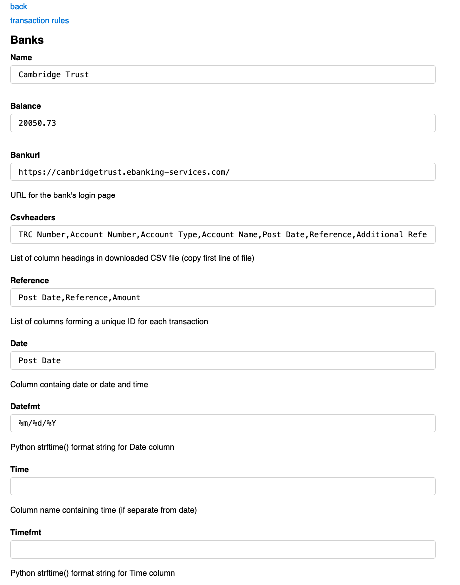

# [Oxford/Cambridge Alumni Group Database](index.md)

## Bank Record

This page is reached through the Edit button on a band row of the [Accounts Page](accounts.md). At the top of the page:

At the top is a 'back' link which takes you back to the accounts page and a 'transaction rules' link which takes you the Bank [Transactions Rules](bank_rules.md) page which manages rules used to automatically assign certain regular payments to the appropriate Account in the 'Chart of Accounts'.

The **Balance** field is updated automatically whenever transactions are uploaded from a .csv file from the bank or payment processor.

The **Bankurl** field is the link to the institution's online banking (or online dashboard) site. In the case of a bank, it probably will be the login page; in the case of the payment processor Stripe it leads directly to the page from which recent transactions can be downloaded. In either case you will need to login apppropriate account details.

**Csvheaders** contains a copy of the header line in the .csv files from the bank, which is used to verify that the input file is in the expected format as well as to label the fields.

**Reference** is a list of one or more column names. The contents of these column(s) will be concatenated to form a unique reference for each transaction.

**Date** and **Time** identify the columns which contain the date and/or time of a transaction. These may be in separate columns of combined in one column. The corresponding ...fmt fields define the format used by the institution in [Python strftime](https://docs.python.org/3.10/library/datetime.html?highlight=strftime#strftime-strptime-behavior) format. Below this:

The **Checknumber**, **Amount**, **Type**, and **Source** fields all specify which column contains the corresponding transaction information.

**Notes** is a list of one or more column names. The contents of these column(s) are concatenated and stored in the transaction record.

**Howto** documents (in [markmin](http://www.web2py.com/examples/static/markmin.html) format) the instructions for downloading transactions from the institution.
