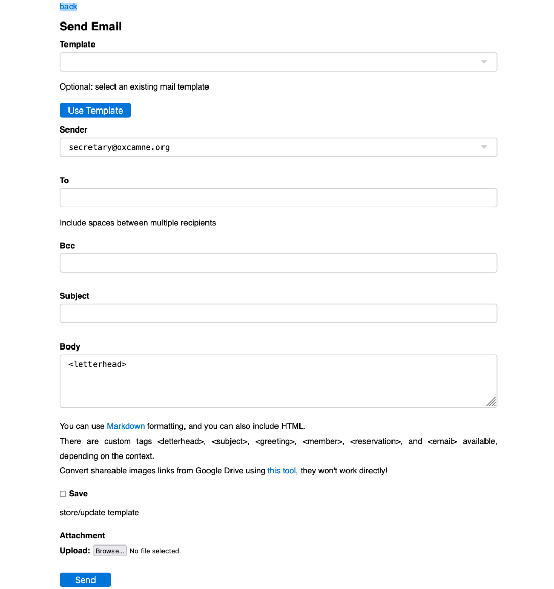

# [Oxford/Cambridge Alumni Group Database](index.md)

## Send Email Page

This screen, reached from the [member record](./member_record.md) or from a number of other contexts, is used to send an individual email or an email notice:

The template form at the top allows you to load a pre-prepared message, which can then be adjusted if necessary. You can save your work as a template by ticking the save box near the bottom of the form.

For an explicitly addressed message 'To:' will be a box allowing the entry of one or more email addresses separated by comma, space or whatever.

If you are sending a notice to a mailing list or to any filtered list of members, it will describe the pre-selected target list.

If the message is explicitly addressed, or targetted to a single member, a 'Bcc:' box allows one or more bcc address(es) to be added. Depending on how email is set up, there may in effect be an implicit bcc to the sender, for example in OxCamNE these sent message will appear in the sender's folder in the Society email.

The Sender field allows you select which address to use if you have multiple roles. Replies will be sent to this address.

The message body can use various metadata elements, such as \<letterhead>,  \<greeting> which include the Society letterhead and a personalized greeting (more or less formal depending on whether the member included a title when joining).  The metadata \<member> is replaced by the member's directory information, and in context \<reservation> will show details of a reservation.

Markdown can  be used to apply some formatting and to include links and graphics. The page includes a link to documentation of Markdown. Pairs of curly braces '{{..}}"can be used to embed arbitrary HTML source content copied from web pages.

You can also select a file to be sent as an attachment, such as a PDF, spreadsheet, image or word document.

Ticking the 'save/update template' box allows the content to be saved for later reuse. With a complex message such as a notice containing graphics, I often develop the message as an email to my own member record, saving as a template to make sure it looks right before sending to the mailing list. The form at the top of the screen allows a template to be loaded; the main form allows the template to be modified before it is sent.
